## Exercice 1 : Lister et créer des branches (1,5 point)

1. Lister les branches existantes dans votre dépôt :
```bash
git branch
```
- Quelles branches sont disponibles ?

```bash
* main
(END)
```
J'ai qu'une seule branche disponible "main".

- Quelle est la branche active ? (Elle sera marquée avec un astérisque `*`).

Ma branche active est "main".

1. Créer une nouvelle branche appelée `feature/ajout-fonctionnalite` :
```bash
git branch feature/ajout-fonctionnalite
```
```bash
➜  methodo git:(main) ✗ git branch feature/ajout-fonctionnalite
```


2. Vérifier que la branche a été créée :
```bash
git branch
```
```bash
  feature/ajout-fonctionnalite
* main
(END)
```


3. Basculer sur la nouvelle branche :
```bash
git checkout feature/ajout-fonctionnalite
```
```bash
➜  td2 git:(feature/ajout-fonctionnalite) ✗ 
```

4. Lister à nouveau les branches et vérifier sur laquelle vous vous trouvez maintenant.

```bash
git branch
```
```bash
* feature/ajout-fonctionnalite
  main
(END)
```
Ici, on voit bien le "*" au niveau de ma nouvelle branche active.

5. Pousser votre nouvelle branche sur votre dépôt distant
```bash
git push -u origin feature/ajout-fonctionnalite
```
```bash
➜  td2 git:(feature/ajout-fonctionnalite) ✗ git push -u origin feature/ajout-fonctionnalite 
Total 0 (delta 0), réutilisés 0 (delta 0), réutilisés du paquet 0 (depuis 0)
remote: 
remote: To create a merge request for feature/ajout-fonctionnalite, visit:
remote:   https://gitlab.com/Malayme/travail-1-methodo/-/merge_requests/new?merge_request%5Bsource_branch%5D=feature%2Fajout-fonctionnalite
remote: 
To gitlab.com:Malayme/travail-1-methodo.git
 * [new branch]      feature/ajout-fonctionnalite -> feature/ajout-fonctionnalite
la branche 'feature/ajout-fonctionnalite' est paramétrée pour suivre 'origin/feature/ajout-fonctionnalite'.
```

## Exercice 2 : Travailler sur une branche et la fusionner (1,5 point)

1. Sur la branche `feature/ajout-fonctionnalite`, créez un fichier `nouvelle_fonction.py` :
```bash
echo -e "def nouvelle_fonction():\n    print('Nouvelle fonctionnalité ajoutée')" > nouvelle_fonction.py
```
```bash
➜  td2 git:(feature/ajout-fonctionnalite) ✗ ls
c2_lemaire-suau_yann_td2_cyber1.md images                             nouvelle_fonction.py
```

2. Ajouter le fichier au suivi de Git :
```bash
git add nouvelle_fonction.py
```
```bash
➜  td2 git:(feature/ajout-fonctionnalite) ✗ git status
Sur la branche feature/ajout-fonctionnalite
Votre branche est à jour avec 'origin/feature/ajout-fonctionnalite'.

Modifications qui seront validées :
  (utilisez "git restore --staged <fichier>..." pour désindexer)
	nouveau fichier : nouvelle_fonction.py
```


3. Commiter les modifications :
```bash
git commit -m "Ajout d'une nouvelle fonction dans nouvelle_fonction.py"
```
```bash
td2 git:(feature/ajout-fonctionnalite) ✗ git log --oneline
18705ef (HEAD -> feature/ajout-fonctionnalite) Ajout d'une nouvelle fonction dans nouvelle_fonction.py
```

4. Retourner sur la branche `main` :
```bash
git checkout main
```
```bash
➜  td2 git:(feature/ajout-fonctionnalite) ✗ git checkout main
M	.DS_Store
Basculement sur la branche 'main'
Votre branche est à jour avec 'origin/main'.
```

5. Fusionner la branche `feature/ajout-fonctionnalite` dans `main` :
```bash
git merge feature/ajout-fonctionnalite
```
```bash
➜  td2 git:(main) ✗ git merge feature/ajout-fonctionnalite
Mise à jour 715ed27..18705ef
Fast-forward
 td2/c2_lemaire-suau_yann_td2_cyber1.md | 589 +++++++++++++++++++++++++++++++++++++++++++++++++++++++++++++++++++++++++++++++++++++++++++++++++++++++++++++++++++++++++++++++++++++++++++++++++++++++++++++++++++++++++++++++++++++++++++++++++++
 td2/nouvelle_fonction.py               |   2 +
 2 files changed, 591 insertions(+)
 create mode 100644 td2/c2_lemaire-suau_yann_td2_cyber1.md
 create mode 100644 td2/nouvelle_fonction.py
➜  td2 git:(main) ✗ 
```


6. Vérifier que la fusion a bien eu lieu en affichant les logs :
```bash
git log --oneline
```
```bash
18705ef (HEAD -> main, feature/ajout-fonctionnalite) Ajout d'une nouvelle fonction dans nouvelle_fonction.py
```

7. Expliquez le résultat obtenu : avez-vous réalisé une fusion rapide ou un commit de fusion ? Pour vous aider, consultez : [Fusion rapide et commit de fusion](https://gitlab.com/mpuren/methodo-travail-cyber1/-/blob/main/cours2_gerer_branches/1_creer_utiliser_branches.md?ref_type=heads#fusion-rapide-et-commit-de-fusion).

Nous avons éffectué une fusion rapide car la branche feature  est une extension directe de la branche main et car on inclut les les commits de la branche feature à la branche main sans combiner les changements
   
## Exercice 3 : Créer un conflit et le résoudre (1,5 point)

1. Sur la branche `main`, modifiez le fichier `nouvelle_fonction.py` pour changer le texte de la fonction :
```bash
echo -e "def nouvelle_fonction():\n    print('Modification sur la branche main')" > nouvelle_fonction.py
```
```bash
➜  td2 git:(main) ✗ echo -e "def nouvelle_fonction():\n    print('Modification sur la branche main')" > nouvelle_fonction.py
```
2. Commitez la modification dans `main` :
```bash
git add nouvelle_fonction.py
git commit -m "Modification de la fonction dans la branche main"
```
```bash
➜  td2 git:(main) ✗ git add nouvelle_fonction.py
➜  td2 git:(main) ✗ git commit -m "Modification de la fonction dans la branche main"
[main e25901c] Modification de la fonction dans la branche main
 1 file changed, 1 insertion(+), 1 deletion(-)
➜  td2 git:(main) ✗ 
```

3. Retournez sur la branche `feature/ajout-fonctionnalite` et modifiez également le fichier `nouvelle_fonction.py` :
```bash
echo "def nouvelle_fonction():\n    print('Modification sur la branche feature')" > nouvelle_fonction.py
```
```bash
➜  td2 git:(feature/ajout-fonctionnalite) ✗ echo "def nouvelle_fonction():\n    print('Modification sur la branche feature')" > nouvelle_fonction.py
```

4. Commitez cette modification :
```bash
git add nouvelle_fonction.py
git commit -m "Modification de la fonction dans feature/ajout-fonctionnalite"
```
```bash
➜  td2 git:(feature/ajout-fonctionnalite) ✗ git commit -m "Modification de la fonction dans feature/ajout-fonctionnalite"
[feature/ajout-fonctionnalite 3f1576c] Modification de la fonction dans feature/ajout-fonctionnalite
 1 file changed, 1 insertion(+), 1 deletion(-)
 ```

5. Retourner sur la branche `main` et tenter de fusionner la branche `feature/ajout-fonctionnalite` dans `main` :
```bash
git checkout main
git merge feature/ajout-fonctionnalite
```
```bash
➜  td2 git:(main) ✗ git merge feature/ajout-fonctionnalite
Fusion automatique de td2/nouvelle_fonction.py
CONFLIT (contenu) : Conflit de fusion dans td2/nouvelle_fonction.py
La fusion automatique a échoué ; réglez les conflits et validez le résultat.
```


6. Résoudre le conflit :
- Git vous informera qu'il y a un conflit dans `nouvelle_fonction.py`. Ouvrez le fichier et résolvez le conflit en décidant quelle version garder ou en combinant les deux.
- Une fois le conflit résolu, ajoutez le fichier :
```bash
git add nouvelle_fonction.py
```
```bash
➜  td2 git:(main) ✗ vim nouvelle_fonction.py 
➜  td2 git:(main) ✗ git add nouvelle_fonction.py
```


7. Finaliser la fusion :
```bash
git commit -m "Résolution du conflit dans nouvelle_fonction.py"
```
```bash
➜  td2 git:(main) ✗ git commit -m "Résolution du conflit dans nouvelle_fonction.py"
[main d4567ff] Résolution du conflit dans nouvelle_fonction.py
```

8. Poussez vos modifications sur GitLab

```bash
➜  td2 git:(main) ✗ git push
Énumération des objets: 18, fait.
Décompte des objets: 100% (17/17), fait.
Compression par delta en utilisant jusqu'à 8 fils d'exécution
Compression des objets: 100% (12/12), fait.
Écriture des objets: 100% (12/12), 1.06 Kio | 1.06 Mio/s, fait.
Total 12 (delta 8), réutilisés 0 (delta 0), réutilisés du paquet 0 (depuis 0)
To gitlab.com:Malayme/travail-1-methodo.git
   aee1ff0..d4567ff  main -> main
   ```

### Questions à répondre après l'exercice : (1 point)

1. Pourquoi un conflit est-il survenu lorsque vous avez tenté de fusionner les deux branches ?

Un conflit est survenu car il y a eu une modification du même fichier sur 2 branches différentes.

2. Quelle méthode avez-vous utilisée pour résoudre le conflit dans le fichier `nouvelle_foctionnalite.py` ?

J'ai tout simlement ouvert le fichier avec Vim et j'ai supprimé les marqueurs de conflit pour ainsi fusionné les deux modifications.

3. Quel message de commit avez-vous utilisé pour documenter la résolution du conflit ?

Le message était "Résolution du conflit dans nouvelle_fonction.py".

4. Quelle est l’importance de résoudre les conflits dans le développement collaboratif ?

Si on ne résout pas les conflits lors d'un développement collaboratif, lorsqu'on va vouloir fusionner les branches ça ne sera pas possible et on ralenti le développement.

## Exercice 4 : Supprimer une branche (1 point)

1. Vérifier que la branche `feature/ajout-fonctionnalite` a bien été fusionnée dans `main` en affichant l'historique des commits :
```bash
git log --oneline
```
```bash
d4567ff Résolution du conflit dans nouvelle_fonction.py
3f1576c (feature/ajout-fonctionnalite) Modification de la fonction dans feature/ajout-fonctionnalite
```


2. Supprimer la branche `feature/ajout-fonctionnalite` car elle n'est plus nécessaire :
```bash
git branch -d feature/ajout-fonctionnalite
```
```bash
➜  td2 git:(main) ✗ git branch -d feature/ajout-fonctionnalite
avertissement : branche 'feature/ajout-fonctionnalite' non supprimée car elle n'a pas encore été fusionnée dans
         'refs/remotes/origin/feature/ajout-fonctionnalite', même si elle est fusionnée dans HEAD
erreur : la branche 'feature/ajout-fonctionnalite' n'est pas complètement fusionnée
astuce : Si vous souhaitez réellement la supprimer, lancez 'git branch -D feature/ajout-fonctionnalite'
astuce : Disable this message with "git config advice.forceDeleteBranch false"
```

> Si la commande ne fonctionne pas, remplacez `-d` par `-D`. Expliquez pourquoi.

On voit que la commande ne marche pas. Précédemment non avons fusionner uniquement un seule fichier et pas tout le contenu de la branche modifié. -d est une suppression sécurisée qui empêche de supprimer par erreur des modifications non fusionnées. -D est un flag qui force la suppression même si la branche n'a pas été fusionnée. Et sur ma machine j'ai des fichiers cachés .DS_Store qui se créé pour permettre l'affichage d'images et donc ils sont condérés comme des modifications non-fusionnés.

```bash
➜  td2 git:(main) ✗ git branch -D feature/ajout-fonctionnalite
Branche feature/ajout-fonctionnalite supprimée (précédemment 3f1576c).
```


3. Vérifier que la branche a bien été supprimée :
```bash
git branch
```
```bash
* main
(END)
```

4. Pousser vos modifications sur GitLab et vérifiez que la branche a bien disparu en ligne 
```bash
git push -u origin main
```
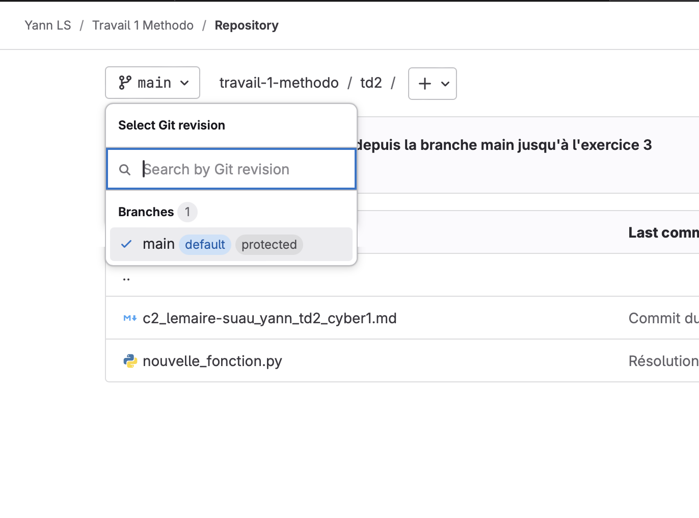

## Exercice 5 : Annuler une fusion avec `git merge --abort` après un conflit (1,5 point)

1. Assurez-vous d’être sur la branche principale (main) :
```bash
git checkout main
```
```bash
➜  td2 git:(main) ✗
```


1. Créez un nouveau fichier et ajoutez-y la ligne suivante :
```bash
echo "Ligne initiale sur main" > mon-fichier.txt
git add mon-fichier.txt
git commit -m "Ajout du fichier mon-fichier.txt sur la branche main"
```
```bash
➜  td2 git:(main) ✗ echo "Ligne initiale sur main" > mon-fichier.txt
➜  td2 git:(main) ✗ git add mon-fichier.txt 
➜  td2 git:(main) ✗ git commit -m "Ajout du fichier mon-fichier.txt sur la branche main"
[main fb93997] Ajout du fichier mon-fichier.txt sur la branche main
 1 file changed, 1 insertion(+)
 create mode 100644 td2/mon-fichier.txt
 ```


2. Créez une nouvelle branche à partir de la branche principale :
```bash
git checkout -b ma-nouvelle-branche
```
```bash
➜  td2 git:(main) ✗ git checkout -b ma-nouvelle-branche
Basculement sur la nouvelle branche 'ma-nouvelle-branche'
➜  td2 git:(ma-nouvelle-branche) ✗ 
```


3. Modifiez le fichier `mon-fichier.txt` sur cette nouvelle branche et validez les changements. Ajoutez la ligne suivante au fichier :
```bash
echo "Modification depuis ma-nouvelle-branche" >> mon-fichier.txt
git add mon-fichier.txt
git commit -m "Modification du fichier mon-fichier.txt sur ma-nouvelle-branche"
```
```bash
➜  td2 git:(ma-nouvelle-branche) ✗ echo "Modification depuis ma-nouvelle-branche" >> mon-fichier.txt
➜  td2 git:(ma-nouvelle-branche) ✗ git add mon-fichier.txt 
➜  td2 git:(ma-nouvelle-branche) ✗ git commit -m "Modification du fichier mon-fichier.txt sur ma-nouvelle-branche"
[ma-nouvelle-branche d944025] Modification du fichier mon-fichier.txt sur ma-nouvelle-branche
 1 file changed, 1 insertion(+)
 ```


4. Revenez à la branche principale :
```bash
git checkout main
```
```bash
Basculement sur la branche 'main'
Votre branche est en avance sur 'origin/main' de 1 commit.
  (utilisez "git push" pour publier vos commits locaux)
➜  td2 git:(main) ✗ 
```


5. Modifiez à nouveau le fichier `mon-fichier.txt` sur la branche principale et validez les changements. Ajoutez cette ligne au fichier :
```bash
echo "Modification depuis la branche main" >> mon-fichier.txt
git add mon-fichier.txt
git commit -m "Modification du fichier mon-fichier.txt sur main"
```
```bash
➜  td2 git:(main) ✗ echo "Modification depuis la branche main" >> mon-fichier.txt
➜  td2 git:(main) ✗ git add mon-fichier.txt
➜  td2 git:(main) ✗ git commit -m "Modification du fichier mon-fichier.txt sur main"
[main 639d21d] Modification du fichier mon-fichier.txt sur main
 1 file changed, 1 insertion(+)
 ```


6. Tentez de fusionner `ma-nouvelle-branche` dans "main" :
```bash
git merge ma-nouvelle-branche
```
```bash
➜  td2 git:(main) ✗ git merge ma-nouvelle-branche 
Fusion automatique de td2/mon-fichier.txt
CONFLIT (contenu) : Conflit de fusion dans td2/mon-fichier.txt
La fusion automatique a échoué ; réglez les conflits et validez le résultat.
```

Un conflit se produira car le fichier `mon-fichier.txt` a été modifié dans les deux branches.

7. Annulez la fusion pour éviter le conflit :
```bash
git merge --abort
```
```bash
➜  td2 git:(main) ✗ git merge --abort
```


8. Une fois la fusion annulée, supprimez la branche créée au début :
```bash
git branch -d ma-nouvelle-branche
```
```bash
➜  td2 git:(main) ✗ git branch -d ma-nouvelle-branche 
erreur : la branche 'ma-nouvelle-branche' n'est pas complètement fusionnée
astuce : Si vous souhaitez réellement la supprimer, lancez 'git branch -D ma-nouvelle-branche'
astuce : Disable this message with "git config advice.forceDeleteBranch false"
```

> Si la commande ne fonctionne pas, remplacez `-d` par `-D`. Expliquez pourquoi.

Je dois utiliser '-D' à chaque fois parce que toutes mes modifications ne sont pas fusionnées. Comme le fichier .DS_Store qui se créer.

```bash
➜  td2 git:(main) ✗ git branch -D ma-nouvelle-branche
Branche ma-nouvelle-branche supprimée (précédemment d944025).
```

## Exercice 6 : Annuler une fusion avec `git reset --hard HEAD~1` (1 point)

1. Créez une nouvelle branche :
```bash
git checkout -b ma-nouvelle-branche
```
```bash
➜  td2 git:(main) ✗ git checkout -b ma-nouvelle-branche
Basculement sur la nouvelle branche 'ma-nouvelle-branche'
➜  td2 git:(ma-nouvelle-branche) ✗
```


2. Modifiez un fichier et validez les changements :  
Ajoutez une modification dans un fichier.
```bash
echo "Modification importante" >> fichier.txt
git add fichier.txt
git commit -m "Modification du fichier.txt"
```
```bash
➜  td2 git:(ma-nouvelle-branche) ✗ echo "Modification importante" >> fichier.txt
➜  td2 git:(ma-nouvelle-branche) ✗ git add fichier.txt 
➜  td2 git:(ma-nouvelle-branche) ✗ git commit -m "Modification du fichier.txt"
[ma-nouvelle-branche 0173862] Modification du fichier.txt
 1 file changed, 1 insertion(+)
 create mode 100644 td2/fichier.txt
 ```


3. Revenez à la branche principale :
```bash
git checkout main
```
```bash
➜  td2 git:(ma-nouvelle-branche) ✗ git checkout main
M	.DS_Store
Basculement sur la branche 'main'
Votre branche est à jour avec 'origin/main'.
➜  td2 git:(main) ✗ 
```

4. Fusionnez la branche créée avec la branche principale :
```bash
git merge ma-nouvelle-branche
```
```bash
➜  td2 git:(main) ✗ git merge ma-nouvelle-branche
Mise à jour 255c92f..0173862
Fast-forward
 td2/fichier.txt | 1 +
 1 file changed, 1 insertion(+)
 create mode 100644 td2/fichier.txt
 ```


5. Annulez la fusion en supprimant le dernier commit :
```bash
git reset --hard HEAD~1
```
```bash
➜  td2 git:(main) ✗ git reset --hard HEAD~1
HEAD est maintenant à 255c92f Commit de la capture de la suppression de la branche, exo 4
```


6. Supprimez la branche :
```bash
git branch -d ma-nouvelle-branche
```
```bash
➜  td2 git:(main) ✗ git branch -D ma-nouvelle-branche
Branche ma-nouvelle-branche supprimée (précédemment 0173862).
```


> Si la commande ne fonctionne pas, remplacez `-d` par `-D`. Expliquez pourquoi.

J'ai remplacé par `-D` car j'ai des fichiers cachés .DS_Store qui ne sont pas fusionnés.

# Créer une Merge Request

## Exercice 7 : Créer une issue dans GitLab (0,5 points)
*A la fin de l'exercice, faîtes une capture d'écran montrant que vous avez bien créé l'issue.*

1. Connectez-vous à GitLab et ouvrez votre projet.
2. Dans le menu du projet, cliquez sur Issues puis sur New issue.
3. Remplissez les champs comme suit :
   - Titre : "Ajouter une fonctionnalité de message de bienvenue personnalisé"
   - Description : "Ajouter une fonction qui prend en entrée un nom et affiche un message de bienvenue personnalisé comme 'Bienvenue, [Nom]'."
   - Assignez-vous cette issue (ou assignez-la à un membre de votre équipe).
4. Cliquez sur Submit issue pour créer l'issue.

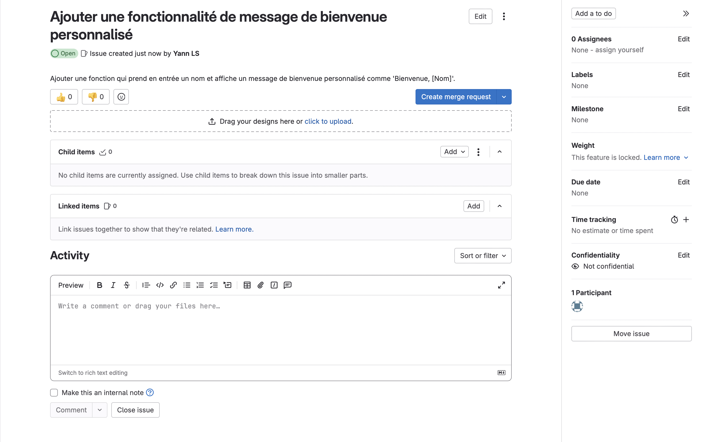

## Exercice 8 : Créer une nouvelle branche pour résoudre l'issue (1 point)

1. Créez une nouvelle branche pour travailler sur la fonctionnalité. Utilisez un nom de branche qui se réfère à l'issue. Par exemple :
```bash
git checkout -b feature/message-bienvenue
```
```bash
➜  td2 git:(main) ✗ git checkout -b feature/message-bienvenue
Basculement sur la nouvelle branche 'feature/message-bienvenue'
```

2. Développez la fonctionnalité dans cette nouvelle branche : créer le fichier `app.py` et ajoutez la fonction suivante :
```python
def afficher_bienvenue(nom):
   return f"Bienvenue, {nom}!"
```
```bash
➜  td2 git:(feature/message-bienvenue) ✗ vim app.py
```

3. Ajoutez et commitez les modifications :
```bash
git add app.py
git commit -m "Ajout de la fonction de message de bienvenue personnalisé"
```
```bash
➜  td2 git:(feature/message-bienvenue) ✗ git add app.py
➜  td2 git:(feature/message-bienvenue) ✗ git commit -m "Ajout de la fonction de message de bienvenue personnalisé"
```


4. Poussez votre branche sur GitLab :
```bash
git push origin feature/message-bienvenue
```
```bash
➜  td2 git:(feature/message-bienvenue) ✗ git push origin feature/message-bienvenue
Énumération des objets: 6, fait.
Décompte des objets: 100% (6/6), fait.
Compression par delta en utilisant jusqu'à 8 fils d'exécution
Compression des objets: 100% (4/4), fait.
Écriture des objets: 100% (4/4), 423 octets | 423.00 Kio/s, fait.
Total 4 (delta 2), réutilisés 0 (delta 0), réutilisés du paquet 0 (depuis 0)
remote: 
remote: To create a merge request for feature/message-bienvenue, visit:
remote:   https://gitlab.com/Malayme/travail-1-methodo/-/merge_requests/new?merge_request%5Bsource_branch%5D=feature%2Fmessage-bienvenue
remote: 
To gitlab.com:Malayme/travail-1-methodo.git
 * [new branch]      feature/message-bienvenue -> feature/message-bienvenue
 ```


## Exercice 9 : Créer une Merge Request (MR) liée à l'issue (1 point)
*A la fin de l'exercice, faîtes une capture d'écran montrant que vous avez bien créé la Merge Request.*

1. Retournez sur GitLab et allez dans la section Merge Requests.
2. Cliquez sur New Merge Request. 
> Vous êtes libre de la nommer comme vous le souhaitez. Pensez seulement à utiliser un nom en lien avec le résultat produit par la fonction Python (par exemple : "Afficher un message de bienvenue")
3. Sélectionnez la branche `feature/message-bienvenue` comme source et la branche `main` comme cible.
4. Dans la description de la Merge Request, référencez l'issue en utilisant son numéro pour lier la MR à l'issue :
Par exemple, si l'issue est `#1`, ajoutez :
```plaintext
Closes #1
```
Cela fermera automatiquement l'issue une fois la Merge Request fusionnée.
5. Ajoutez une description claire de ce que fait la Merge Request. Par exemple :
```plaintext
Cette Merge Request ajoute une fonctionnalité de message de bienvenue personnalisé. La fonction `afficher_bienvenue` prend un nom en entrée et affiche un message de bienvenue.
```
6. Cliquez sur Submit Merge Request.


## Exercice 10 : Revue de la Merge Request et fusion (2 points)

1. Demandez à un camarade de passer en revue votre Merge Request.
   - Ajoutez-le à votre projet avec les droits suffisants pour qu'il puisse relire la Merge Request
   - Demandez lui de laisser un commentaire : par exemple, il peut vous demander d'ajouter dans le code
```markdown
# Définition de la fonction 'afficher_bienvenue' qui prend un paramètre 'nom'
# Utilisation d'une f-string pour insérer la variable 'nom' dans le message de bienvenue
# Exemple d'utilisation de la fonction
```
```python
# Ici, nous appelons la fonction avec le nom "Alice" et affichons le message de retour
message = afficher_bienvenue("Alice")  # Appel de la fonction avec "Alice" comme paramètre
print(message)  # Affiche : Bienvenue, Alice!
```

*Faîtes une capture d'écran montrant ce que vous voyez maintenant quand vous ouverz la MR.*

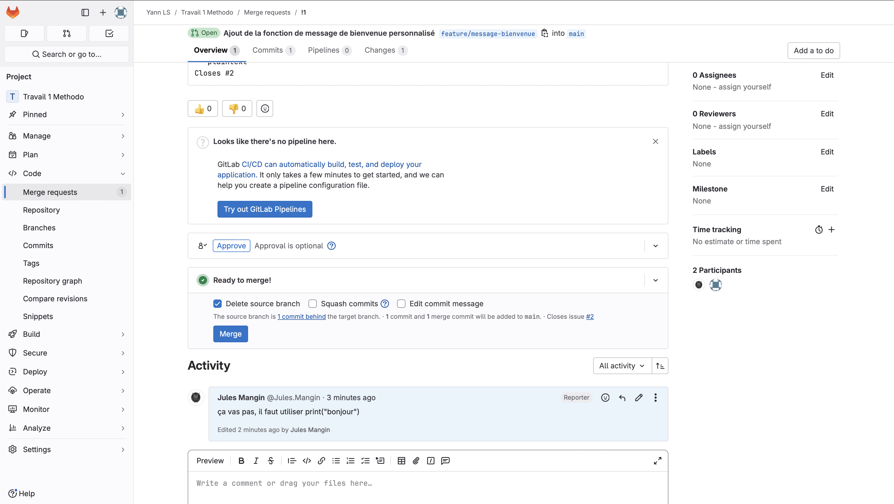

2. Faites les modifications demandées sur votre branche locale, puis poussez à nouveau les changements :

Le fichier modifié doit ressembler à ceci : 

```python
# Définition de la fonction 'afficher_bienvenue' qui prend un paramètre 'nom'
def afficher_bienvenue(nom):
    """
    Cette fonction prend un nom en paramètre et retourne un message de bienvenue personnalisé.

    :param nom: str : Le nom de la personne à accueillir
    :return: str : Le message de bienvenue personnalisé
    """
    # Utilisation d'une f-string pour insérer la variable 'nom' dans le message de bienvenue
    return f"Bienvenue, {nom}!"

# Exemple d'utilisation de la fonction
# Ici, nous appelons la fonction avec le nom "Alice" et affichons le message de retour
message = afficher_bienvenue("Alice")  # Appel de la fonction avec "Alice" comme paramètre
print(message)  # Affiche : Bienvenue, Alice!
```

```bash
git add .
git commit -m "Correction après revue de code"
git push origin feature/message-bienvenue
```
```bash
➜  methodo git:(feature/message-bienvenue) ✗ git add . 
➜  methodo git:(feature/message-bienvenue) ✗ git status            
Sur la branche feature/message-bienvenue
Modifications qui seront validées :
  (utilisez "git restore --staged <fichier>..." pour désindexer)
	nouveau fichier : td2/.DS_Store
	modifié :         td2/app.py
	modifié :         td2/c2_lemaire-suau_yann_td2_cyber1.md
	nouveau fichier : td2/images/.DS_Store
	nouveau fichier : td2/images/capture_commentaire.png
	nouveau fichier : td2/images/capture_delete_branch.png
	nouveau fichier : td2/images/capture_issue_closed.png
	nouveau fichier : td2/images/capture_merge_request.png
	nouveau fichier : td2/images/capture_modification.png

➜  methodo git:(feature/message-bienvenue) ✗ git commit -m "Correction après revue de code"
[feature/message-bienvenue 3d5fa19] Correction après revue de code
 9 files changed, 49 insertions(+), 1 deletion(-)
 create mode 100644 td2/.DS_Store
 create mode 100644 td2/images/.DS_Store
 create mode 100644 td2/images/capture_commentaire.png
 create mode 100644 td2/images/capture_delete_branch.png
 create mode 100644 td2/images/capture_issue_closed.png
 create mode 100644 td2/images/capture_merge_request.png
 create mode 100644 td2/images/capture_modification.png
➜  methodo git:(feature/message-bienvenue) git push origin feature/message-bienvenue 
Énumération des objets: 197, fait.
Décompte des objets: 100% (197/197), fait.
Compression par delta en utilisant jusqu'à 8 fils d'exécution
Compression des objets: 100% (142/142), fait.
Écriture des objets: 100% (197/197), 15.19 Mio | 10.87 Mio/s, fait.
Total 197 (delta 91), réutilisés 116 (delta 49), réutilisés du paquet 0 (depuis 0)
remote: Resolving deltas: 100% (91/91), done.
remote: 
remote: To create a merge request for feature/message-bienvenue, visit:
remote:   https://gitlab.com/Malayme/travail-1-methodo/-/merge_requests/new?merge_request%5Bsource_branch%5D=feature%2Fmessage-bienvenue
remote: 
To gitlab.com:Malayme/travail-1-methodo.git
 * [new branch]      feature/message-bienvenue -> feature/message-bienvenue
``` 


*Faîtes une capture d'écran montrant que vous avez fait les modifications demandées.*

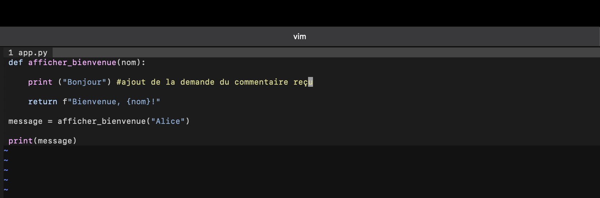

3. Une fois que les modifications sont réalisées, vous pouvez fusionner la MR dans la branche `main` en cliquant sur Merge.
   
4. GitLab fermera automatiquement l'issue liée grâce à la référence `Closes #1` dans la description de la MR.

*Faîtes une capture d'écran montrant que l'issue est close et une autre montrant que la branche `feature/message-bienvenue` n'apparaît plus.*

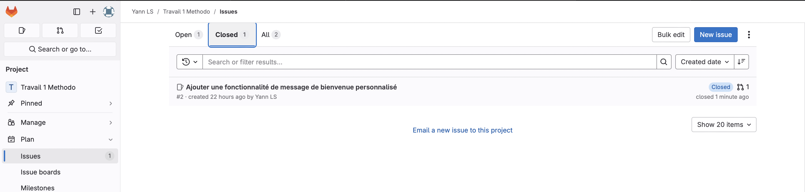

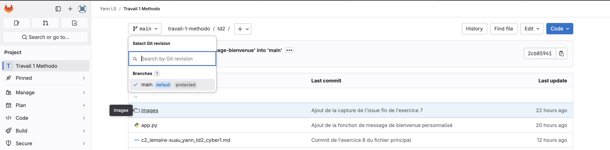

## Exercice 11 : Vérification et nettoyage (0,5 points)

1. Vérifiez que la fonctionnalité est bien fusionnée dans `main` en tirant les dernières modifications :
```bash
git checkout main
git pull origin main
```
```bash
➜  methodo git:(main) git pull
remote: Enumerating objects: 1, done.
remote: Counting objects: 100% (1/1), done.
remote: Total 1 (delta 0), reused 0 (delta 0), pack-reused 0 (from 0)
Dépaquetage des objets: 100% (1/1), 283 octets | 283.00 Kio/s, fait.
Depuis gitlab.com:Malayme/travail-1-methodo
   2cb8594..0128348  main       -> origin/main
Mise à jour e9ceada..0128348
Fast-forward
 td2/.DS_Store                          | Bin 0 -> 6148 bytes
 td2/app.py                             |   9 +++++++++
 td2/c2_lemaire-suau_yann_td2_cyber1.md |  13 +++++++++++++
 td2/images/.DS_Store                   | Bin 0 -> 6148 bytes
 td2/images/capture_commentaire.png     | Bin 0 -> 1953666 bytes
 td2/images/capture_delete_branch.png   | Bin 0 -> 284189 bytes
 td2/images/capture_issue_closed.png    | Bin 0 -> 733964 bytes
 td2/images/capture_merge_request.png   | Bin 0 -> 2005529 bytes
 td2/images/capture_modification.png    | Bin 0 -> 119047 bytes
 9 files changed, 22 insertions(+)
 create mode 100644 td2/.DS_Store
 create mode 100644 td2/app.py
 create mode 100644 td2/images/.DS_Store
 create mode 100644 td2/images/capture_commentaire.png
 create mode 100644 td2/images/capture_delete_branch.png
 create mode 100644 td2/images/capture_issue_closed.png
 create mode 100644 td2/images/capture_merge_request.png
 create mode 100644 td2/images/capture_modification.png
 ```


2. Supprimez la branche `feature/message-bienvenue` localement et sur GitLab si elle n’est plus nécessaire :
```bash
git branch -d feature/message-bienvenue
git push origin --delete feature/message-bienvenue
```
```bash
➜  td2 git:(main) git branch -d feature/message-bienvenue
Branche feature/message-bienvenue supprimée (précédemment 3d5fa19).
```


> Si la commande ne fonctionne pas, remplacez `-d` par `-D`. Expliquez pourquoi.

### Questions à répondre après les exercices : (1 point)

1. Pourquoi est-il important de lier une issue à une Merge Request ?

Il est important de lier une issue à une MR car cela permet une meilleure traçabilité sur quel code à résolu tel problème.

2. Comment GitLab gère-t-il automatiquement la fermeture des issues après la fusion d'une MR ?

GitLab gère automatiquement la fermeture des issues après la fusion d'une MR lorqu'on ajoute "Close" puis en spécifiant le numéro de l'issue, à la fin de la description de la MR

3. Que se passe-t-il si vous ne référencez pas l'issue dans la description de la MR ?

# Exercice 12 : Faire une revue de code (5 points)

*Vous allez **travailler avec un camarade** :* 
*- Vous allez jouer **le rôle du développeur** qui soumet un fichier pour une revue de code et votre camarade jouera le rôle du relecteur ou reviewer.*
*- Votre camarade soumettra lui aussi un fichier pour revue de code, et vous jouerez **le rôle de relecteur**.*

*Pour réaliser cette revue de code, vous allez vous appuyer sur le document portant sur la [revue de code](https://gitlab.com/mpuren/methodo-travail-cyber1/-/blob/main/cours2_gerer_branches/5_revue%20de%20code.md?ref_type=heads).*

*Lorsque vous jouez le rôle de développeur, vous devez faire des **captures d'écran** montrant que :*
*- Vous avez soumis votre fichier pour revue de code.*
*- Vous avez fait les modifications demandées.*
*- Vous avez fermé la Merge Request.*

*Lorsque vous jouez le rôle de relecteur, vous devez faire des **captures d'écran** montrant que vous avez bien soumis la revue de code.*

*Mettez vous d'abord **d'acccord avec votre camarade** : si vous faîtes l'exercice A en tant que développeur, votre camarde doit faire l'exercice B en tant que développeur. Et vice-versa si vous choisissez l'exercice B.*

**Exercice A**

Lors de cet exercice j'étais le développer et Ange-Olivier relecteur (@angeoli2003)

Mise en situation* : 

Vous êtes un développeur débutant qui soumet du code pour relecture. Vous avez écrit un fichier en HTML qui doit afficher "Bonjour tout le monde !".

1. Créez le fichier `bonjour_monde.html` (celui-ci est erroné pour que vos camarades puisse faire la revue de code).

```html
<!DOCTYPE html>
<html lang="fr>
<head>
    <meta charset="UTF-8">
    <meta name="viewport" content="width=device-width, initial-scale=1.0">
    <title>Ma Page</title>
<head>
<body>
    <h1>Bonjour tout le monde<h1>
</body>
</html>
```
Création de l'issue :

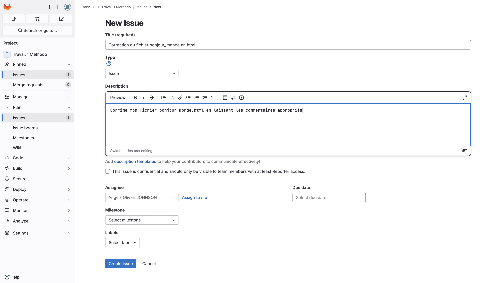

2. Soumettez le fichier pour revue de code. N'oubliez pas d'ajoutez une description.

Création de la MR :

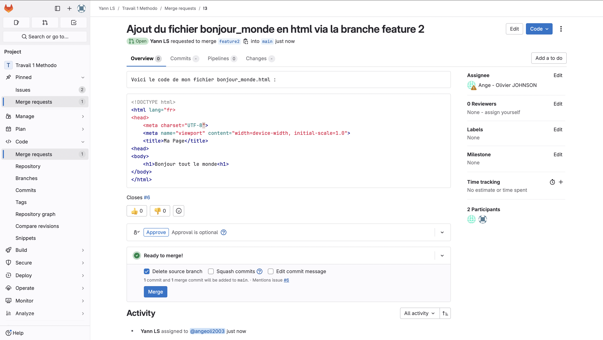

3. Votre camarade doit faire la revue de code suivante :

**Omission de la fermeture de la balise `<html>` :**
- La balise `<html>` n'a pas de guillemets fermant après `lang="fr"`. Il manque un guillemet à la fin de l'attribut de langue. Correction :
```html
<html lang="fr">
```

**Erreur de fermeture de la balise `<head>` :**
- La balise `<head>` est mal fermée. Il faut utiliser `</head>` au lieu de `<head>`. Correction :
```html
</head>
```

**Omission de la fermeture de la balise `<h1>` :**
- La balise `<h1>` n'est pas correctement fermée. Elle doit être fermée avec `</h1>`. Correction :
```html
<h1>Bonjour tout le monde</h1>
```

**Bonne pratique : Ajouter le DOCTYPE complet :**
- Le DOCTYPE est déjà présent et bien utilisé dans ce cas, donc rien à corriger ici. C'est une bonne pratique pour s'assurer que le fichier est interprété comme HTML5.

Commentaires de mon camarade ajoutés :
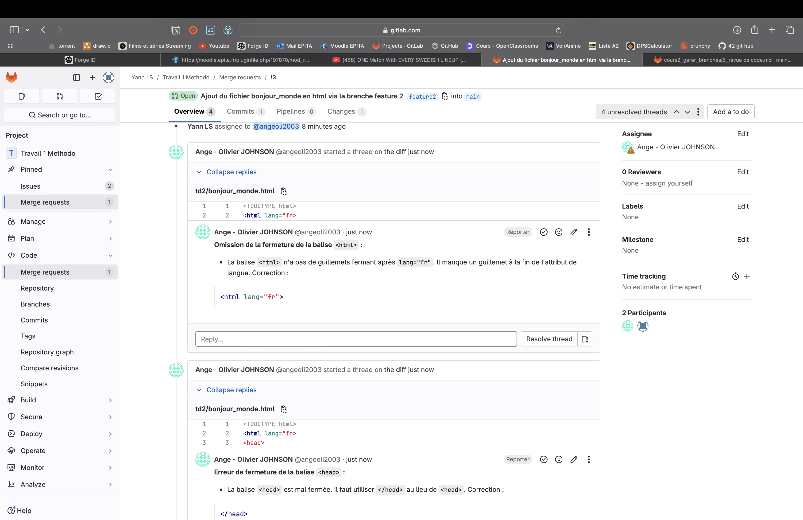

4. Vous allez modifier le fichier en respectant les modifications demandées. Vous obtiendrez le résultat suivant :

```html
<!DOCTYPE html>
<html lang="fr">
<head>
    <meta charset="UTF-8">
    <meta name="viewport" content="width=device-width, initial-scale=1.0">
    <title>Ma Page</title>
</head>
<body>
    <h1>Bonjour tout le monde</h1>
</body>
</html>
```

5. Approuvez la Merge Request.

Merge de la request : 

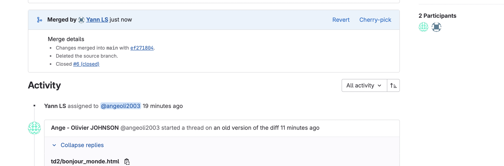

**La branche feature2 a été supprimée**
---

**Exercice B**

Lors de cet exercice je suis relecteur et Ange-Olivier développeur

Mise en situation* : 

Vous êtes un développeur débutant qui soumet du code pour relecture. Vous avez écrit un fichier en HTML qui doit afficher "Bonjour tout le monde !".

1. Créez le fichier suivant `liste_courses.html` (celui-ci est erroné pour que vos camarades puisse faire la revue de code).

```html
<!DOCTYPE html>
<html lang="fr>
<head>
    <meta charset="UTF-8">
    <meta name="viewport" content="width=device-width, initial-scale=1.0">
    <title>Liste d'éléments<title>
<head>
<body>
    <h1>Ma liste de courses</h1>
    <ul>
        <li>Pomme
        <li>Banane
        <li>Orange
    </ul>
    <p>Fin de la liste
</body>
</html>
```

2. Soumettez le fichier pour revue de code. N'oubliez pas d'ajoutez une description.

3. Votre camarade doit faire la revue de code suivante :

**Erreur de fermeture de la balise `<title>` :**
- La balise `<title>` n'est pas correctement fermée. Il faut ajouter `</title>` à la place de la deuxième ouverture de balise `<title>`. Correction :
```html
<title>Liste d'éléments</title>
```

**Erreur de fermeture de la balise `<head>` :**
- La balise `<head>` est incorrectement fermée. Elle doit être fermée avec `</head>`. Correction :
```html
</head>
```

**Omission de la fermeture des balises `<li>` :**
- Chaque élément de liste (`<li>`) doit être correctement fermé avec `</li>`. Voici la correction :
```html
<li>Pomme</li>
<li>Banane</li>
<li>Orange</li>
```

**Erreur de fermeture de la balise `<p>` :**
- La balise `<p>` qui entoure "Fin de la liste" n'est pas fermée. Il faut ajouter `</p>`. Correction :
```html
<p>Fin de la liste</p>
```
Preuve de la revue de code :

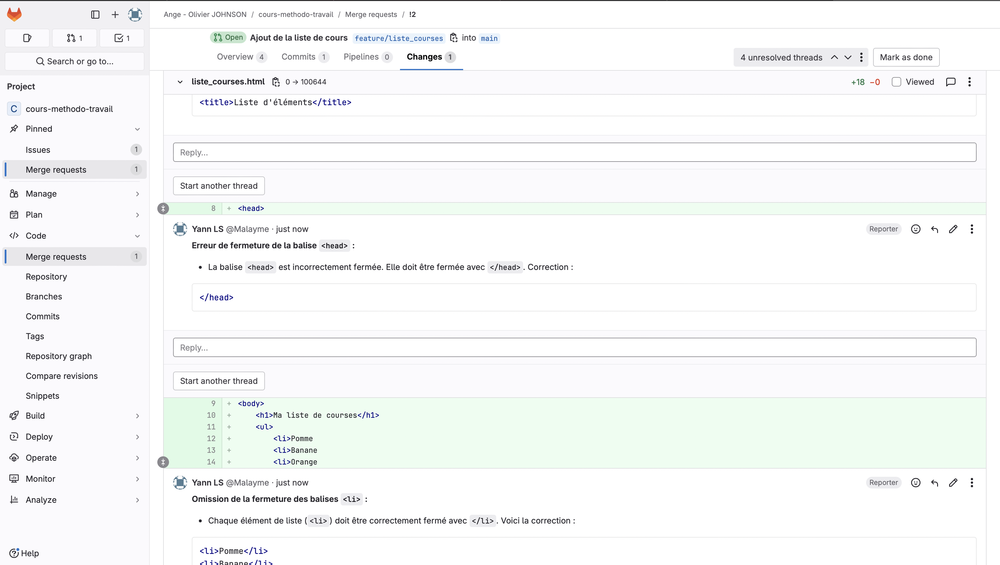

4. Vous allez modifier le fichier en respectant les modifications demandées. Vous obtiendrez le résultat suivant :

```html
<!DOCTYPE html>
<html lang="fr">
<head>
    <meta charset="UTF-8">
    <meta name="viewport" content="width=device-width, initial-scale=1.0">
    <title>Liste d'éléments</title>
</head>
<body>
    <h1>Ma liste de courses</h1>
    <ul>
        <li>Pomme</li>
        <li>Banane</li>
        <li>Orange</li>
    </ul>
    <p>Fin de la liste</p>
</body>
</html>
```

5. Approuvez la Merge Request.
